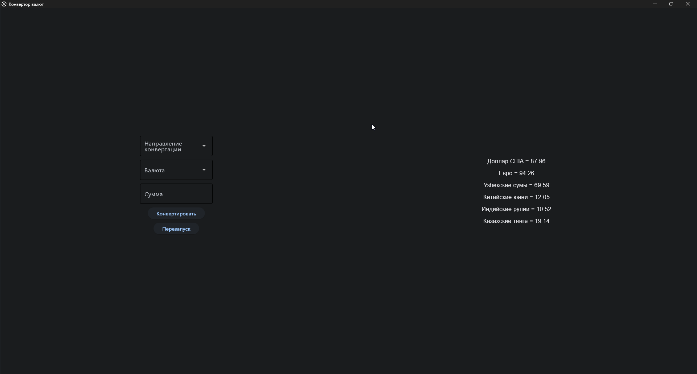

# Конвертор валют
## Описание приложения
Моё приложение - простой конвертор валют с графическим интерфейсом, собранный на Python с помощью библиотеки *flet*.
## Интерфейс приложения

## Установка
Для установки зайдите во вкладку *Releases*, нажмите на exe-файл, и установите его:)
## Использование
Чтобы перевести какую-либо валюту в рубли нажмите на выпадающий список с названием *Направление конвертации*, выберите оттуда пункт *В рубли*, в следующем выпадающем списке выберите валюту, далее укажите сумму и нажмите на кнопку *Конвертировать*.

Чтобы перевести рубли в какую-либо валюту нажмите на выпадающий список с названием *Направление конвертации*, выберите оттуда пункт *Из рублей*, в следующем выпадающем списке выберите валюту, далее укажите сумму и нажмите на кнопку *Конвертировать*.
## Планы реализаций функций
1. Добавить виджет с курсами валют на основе *Rainmeter*.
2. Добавить возможность смены тем интерфейса (светлая/темная)
3. Добавить кросскурсовой перевод, к примеру из USD в EUR.
## Для разработчиков
Если вы разработчик, и хотите использовать мой исходный код для того, чтобы доработать моё приложение под свои нужды, то не забудьте установить необходимые зависимости данными командами:
### Powershell

<pre>
pip install pyinstaller
pip install flet
</pre>

## Вклад пользователей в развитие проекта
Буду рад любой обратной связи!

Если вдруг найдете ошибки, или недочеты в приложении, то сразу пишите во вкладку *Issues*, постараюсь решить вашу проблему как можно скорее.
## Лицензия
Этот проект лицензирован под лицензией MIT - подробности см. в файле LICENSE.
## Благодарности
Иконки предоставлены сервисом [Icons8](https://icons8.com).
